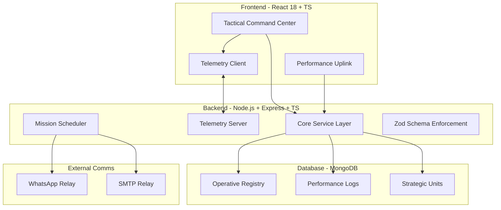

# 🏆 FIT-O-CHARITY Dashboard - Sukrut Parivar Charitable Trust

## 📋 Project Overview

A high-performance, tactical fitness tracking dashboard for **FIT-O-CHARITY**, a fitness initiative by Sukrut Parivar Charitable Trust. The application features real-time performance telemetry, group-based strategic monitoring, and automated mission reminders.

---

## 🎯 Core Features

### 1. Operative Registry
- Participant registration and authentication via unique 6-character identification codes.
- Real-time performance synchronization using WebSockets.
- Zero-friction entry: No passwords required, only mission codes.

### 2. Performance Uplink (Activity Submission)
- Industrial-grade logging interface for daily performance data.
- Modalities: Walking, Running, Cycling, Yoga, Gym.
- Real-time metric synchronization (Distance, Duration, Streaks).
- Instant visual rewards via high-energy celebration protocols.

### 3. Automated Reminder Network
- Daily status audit at 1800H.
- Multi-channel notification: WhatsApp (Twilio) and Email (SMTP).
- Intelligent logic identifies operatives who haven't synchronized data for the current cycle.

### 4. Strategic Unit Operations (Groups)
- Dedicated monitoring environments for teams, organizations, and squads.
- Group-specific performance indices and global rank protocols.
- Rapid unit integration via group codes.

### 5. Tactical UI/UX
- **Cyber-Industrial Aesthetic**: High-contrast, utilitarian design focused on data precision.
- **Dynamic Motion System**: Advanced animations for smooth transitions and data reveals.
- **Live Telemetry**: Real-time stats cards and global activity feed.

---

## 🏗️ System Architecture



---

## 📁 Project Structure

```
sfoc-dashboard/
├── frontend/                 # React + Vite + Tailwind
│   ├── src/
│   │   ├── components/      # Modular UI Units
│   │   ├── pages/           # Tactical Interfaces
│   │   ├── services/        # API & WebSocket Uplinks
│   │   └── App.tsx          # Core Controller
├── backend/                  # Node.js + TypeScript
│   ├── src/
│   │   ├── controllers/     # Mission Logic
│   │   ├── models/          # Data Schemas
│   │   ├── services/        # Business Logic & External Relays
│   │   ├── utils/           # Validation Protocols
│   │   └── websocket/       # Real-time Telemetry
│   └── server.ts            # System Entry
└── README.md                 # System Manual
```

---

## 🎨 Design System: Industrial Cyberpunk

### Color Palette
- **Obsidian** (#050505) - Primary Background
- **Neon Orange** (#FF6B35) - Core Accent / Action
- **Muted Carbon** (#1A1A1A) - Panel Structural
- **Protocol Green** (#2ECC71) - System OK
- **Warning Red** (#FF4B2B) - Attention Required

---

## 📊 Database Schema

### Operative Registry (Participants)
```typescript
{
  name: string,
  email: string,
  mobile: string,
  activityType: string,
  individualCode: string,
  groupCode: string | null,
  totalDistance: number,
  totalDuration: number,
  streakDays: number,
  isActive: boolean
}
```

---

*Engineered for FIT-O-CHARITY | Sukrut Parivar Charitable Trust*